# Hi there 👋 I'm peco2282

[//]: # (
)
[//]: # (  )
[//]: # (
)

## 🚀 About Me

- 🌐 Website: [peco2282.com](https://peco2282.com)
- 🚀 I enjoy writing code in **Kotlin**, **Java**, and **TypeScript**.
- 🔭 I’m currently working on **DevCore**.
- 💬 Ask me about Unity, Python, Kotlin, or Discord Bots.
- 📫 How to reach me:
  
  

## 🛠 Skills

  
  
  
  
  
  
  
  
  
  
  
  
  
  
  
  

---

## 📊 My Stats

  

   

### 📝 Qiita Data

### ⌛ WakaTime

---

## 🤖 Featured Project: Unity-Bot (Inactive)

> [!CAUTION]
> 現在このBotは稼働していません。
> This bot is currently inactive.

DiscordでUnityスクリプトリファレンスのリンクを返すBotです。

- **Prefix:** `,`
- **Help:** `,help`
- **Invite URL:
  ** [Add Unity-Bot to your server](https://discord.com/api/oauth2/authorize?client_id=974141480199405578&permissions=328565091408&scope=bot)
- **Features:** 指定したキーワードが含まれるUnityの日本語版スクリプトリファレンスのリンクを返します。

[Demo on Twitter](https://twitter.com/peco_2282/status/1534753249630519299)

---

## ⚡ Recent Focus: DevCore

  

---

## 🏗 Past Focus: slack.py

  

---

## 🔥 Most Active Repository

  

---

## 📌 Pinned Projects

  
  
  
  

